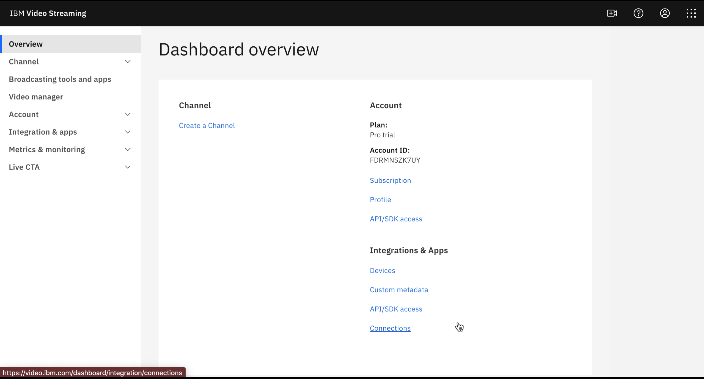
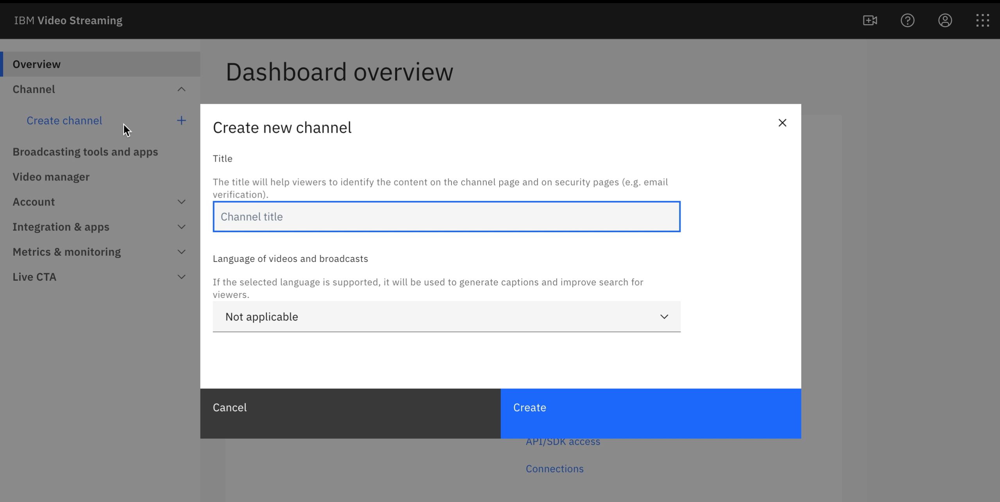
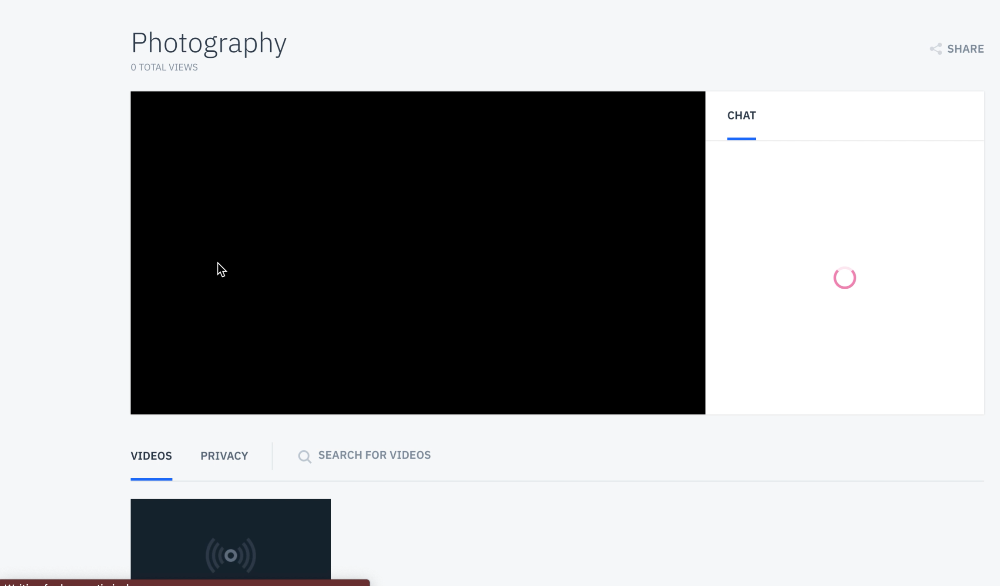
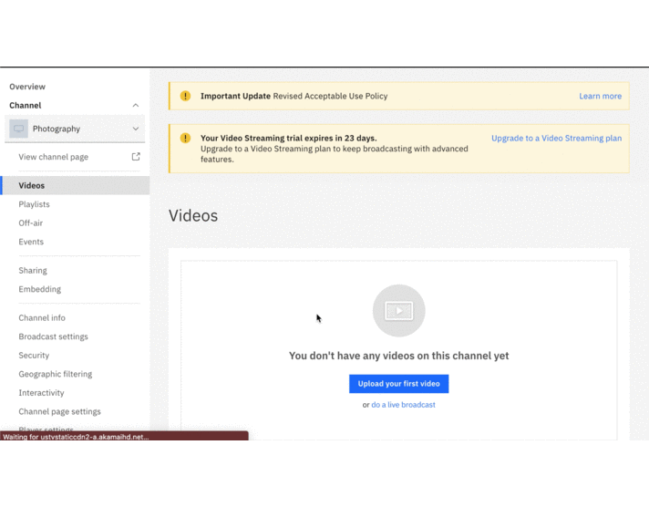

# Build-an-elearning-portal-with-Watson-Media
The COVID pandemic has altered our conventional ways of working in companies, startups, businesses, and Educational Institutes were no different. In the current times, to maintain social distancing, Schools and Colleges are choosing the e-learning platforms to impart education. Though, it started as a  precautionary measure to stop the further spread of the pandemic. But it is turning into a much more effective and efficient mode of teaching in terms of resources. More and more startups are emerging in the educational domain to make use of this window of opportunity.  Therefore, IBM brings forth `IBM Watson Media` to the developer community, which provides almost everything they need to build an e-learning platform for their startup. 

[IBM Watson Media](https://www.ibm.com/watson/media) offers AI-driven solutions for live streaming events, corporate communication, video analytics, and content management. This Comprehensive video streaming platform provides Live stream and auto-archive for video-on-demand viewing to boost overall reach and engagement. Use IBM Watson Media solutions to stream events, executive town halls, video marketing product launches, and entertainment OTT (over-the-top) streaming. Built for scale and reliability, to optimize video quality, and powered by IBM Watson AI for video search and automated closed captioning, our video solutions are used by thousands of enterprises, service providers, educators, and media companies worldwide to improve video workflows, reliability and content monetization.

In this code pattern, we will demonstrate how to quickly build an `e-learning portal` using `Watson Media`.

The Scope of this Code Pattern is limited to following capabilities. `However, the Solutions can be scaled to accomodate a lot more functionalities andd capabilities through the Services, Products, Solutions and APIs provided by Watson Media.`  

- Create channels for different areas of learning. 
- Create and upload videos for a channel.
- Password restrict the access to videos.
- Restrict domains where the video can be embedded.
- Build a web application with authentication to access the channels using the APIs provided by Watson Media. 

### Flow


1. 
1. 
1. 
1. 

# Included components

* [IBM Watson Media](https://www.ibm.com/watson/media): It offers AI-driven solutions for live streaming events, corporate communication, video analytics, and content management.

# Featured technologies

* [Node.js](https://nodejs.org/en/): An asynchronous event driven JavaScript runtime, designed to build scalable applications
* [React](https://reactjs.org/): Javascript library for building User Interfaces


# Watch the Video

[

## Steps
* [Login using IBMID on IBM Watson Media.]()
* [Create the Channels.]()
* [Upload Videos on the Channel.]()
* [Create Playlists.]()
* [Give Password Restriction on the Channel.]()
* [Restrict Domains where video can be embedded.]()
* [Build a web appplication using Channel API.]()

#### Login using IBMID on IBM Watson Media.
If you don't have IBM ID,  create an account on IBM Cloud Account 
- Login to [IBM CLOUD](https://cloud.ibm.com/login).

using the same ID, 
* Click on Free Trial on [Watson Media Page](https://www.ibm.com/watson/media/services)
* Login using IBM ID. Your 30 days free trial of the product will be activated. 



#### Create the Channels.
* Click on `Create Channel`.
  ```
  Note: Free Trial allows you to create only one channel, you need to upgrade to premium account to create more.
  ```
* Give the `Channel Name.` 
* Select the `Language` from the dropdown 
* Hit `Create` button. 


<!-- -->

* To View `Channel Page`, click on the `view Channel Page`



#### Upload Videos on the Channel.
* Click on `Videos Button` on the left-hand side Dashboard. 
* Click `upload` button.
* Select all the files you want to upload from the computer and click `open`.
* Click `Start to Upload` Button. 
* After the upload is complete, Go back to Dashboard, under Videos section, Select all the uploaded videos and Hit Publish. 
    


### Create Playlists.

### Give Password Restriction on the Channel.
### Restrict Domains where video can be embedded.
### Build a web appplication using Channel API.

