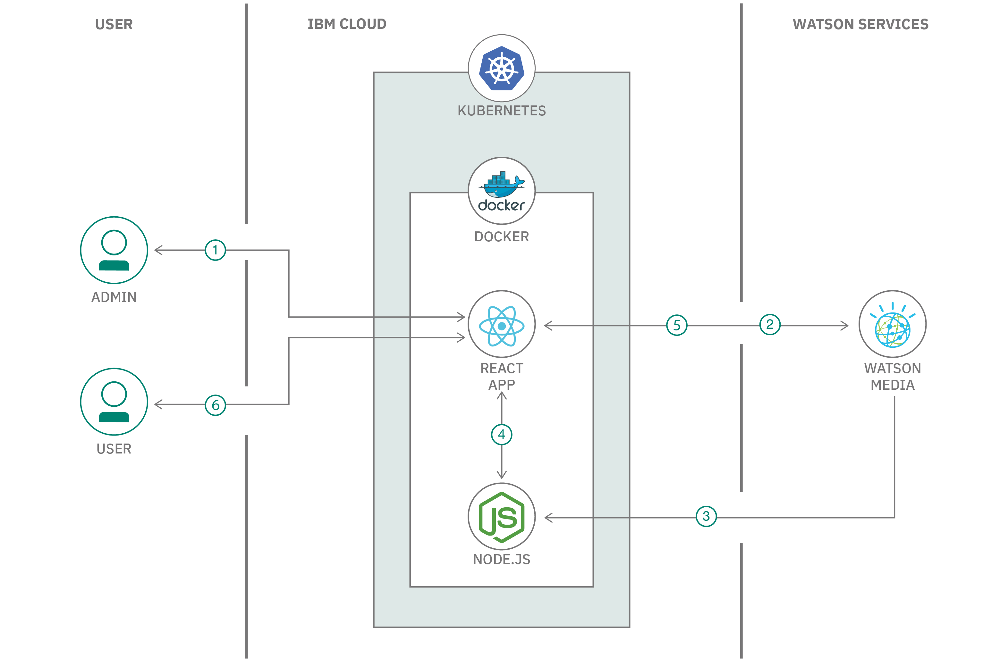
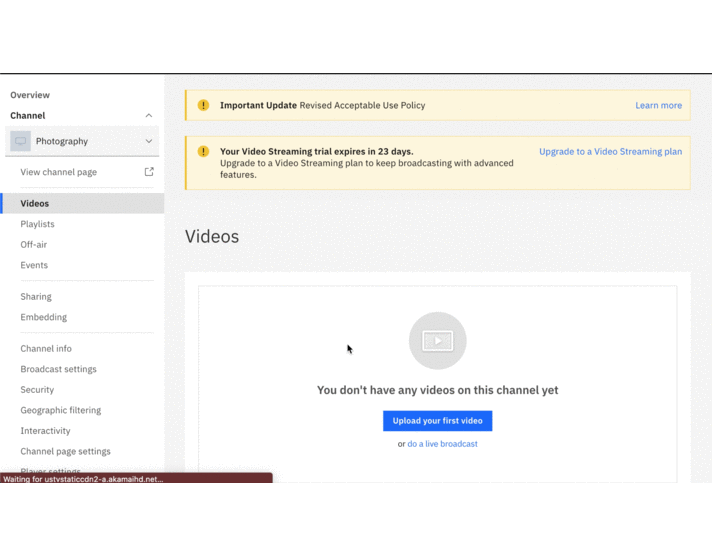
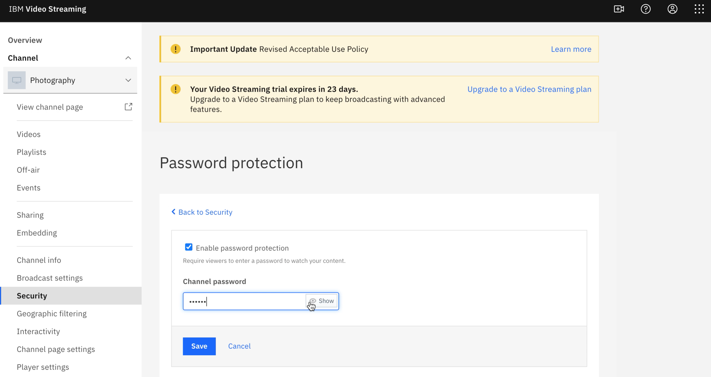
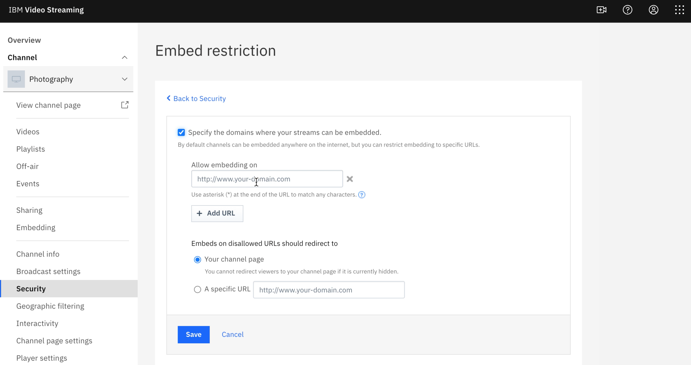
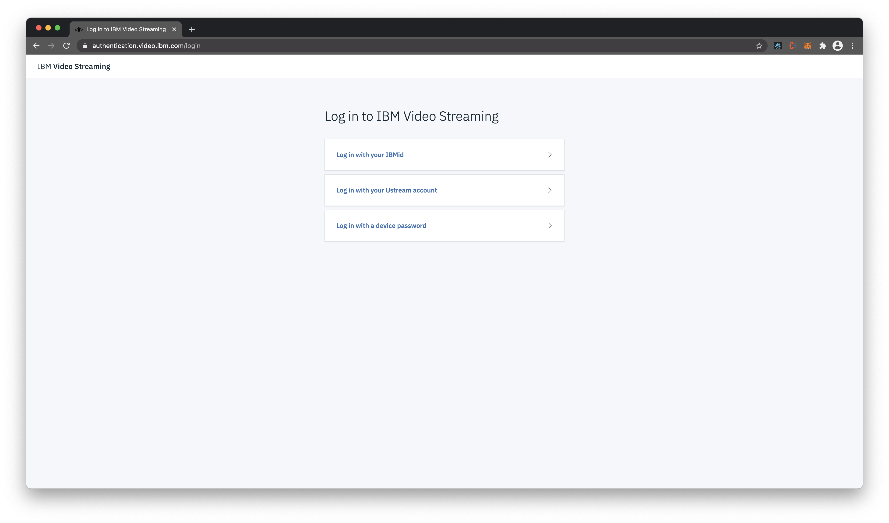
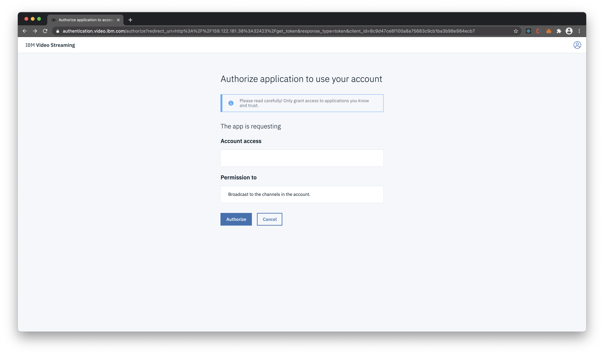
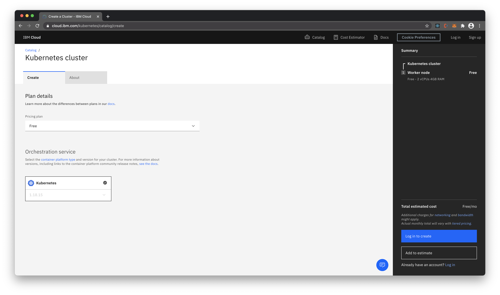
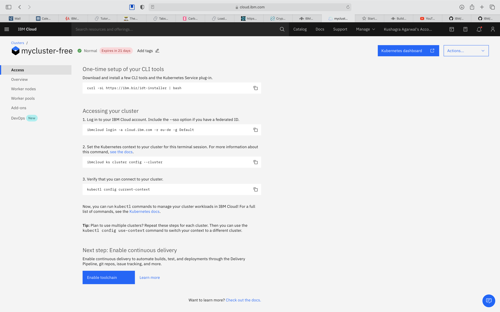
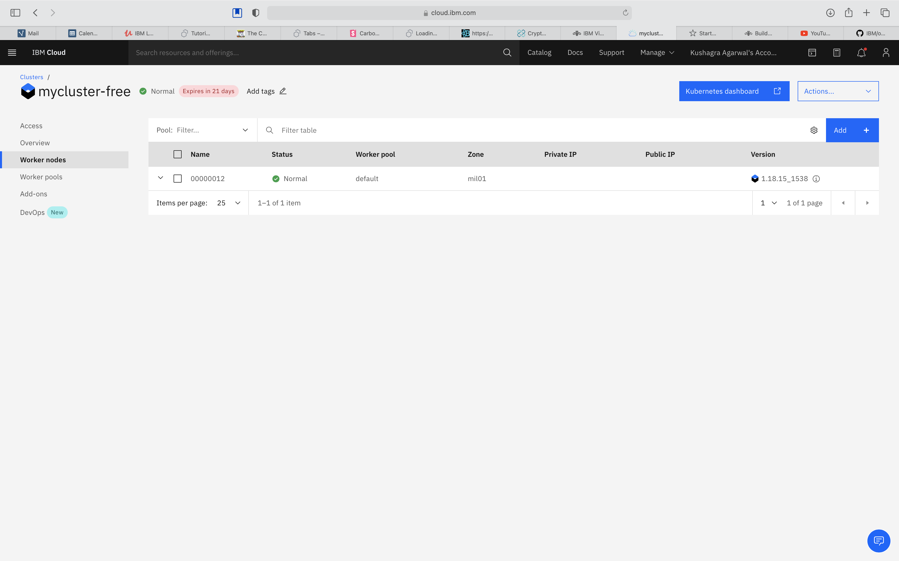
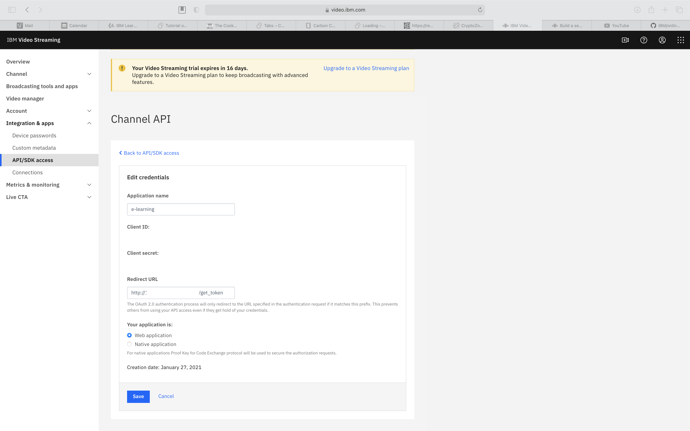

# Build an e-learning portal with Watson Media.

The COVID pandemic has altered our conventional ways of working in companies, startups, businesses, and Educational Institutes were no different. In the current times, to maintain social distancing, Schools and Colleges are choosing the e-learning platforms to impart education. Though, it started as a  precautionary measure to stop the further spread of the pandemic. But it is turning into a much more effective and efficient mode of teaching in terms of resources. More and more startups are emerging in the educational domain to make use of this window of opportunity.  Therefore, IBM brings forth `IBM Watson Media` to the developer community, which provides almost everything they need to build an e-learning platform for their startup. 

[IBM Watson Media](https://www.ibm.com/watson/media) offers AI-driven solutions for live streaming events, corporate communication, video analytics, and content management. This Comprehensive video streaming platform provides Live stream and auto-archive for video-on-demand viewing to boost overall reach and engagement. Use IBM Watson Media solutions to stream events, executive town halls, video marketing product launches, and entertainment OTT (over-the-top) streaming. Built for scale and reliability, to optimize video quality, and powered by IBM Watson AI for video search and automated closed captioning, our video solutions are used by thousands of enterprises, service providers, educators, and media companies worldwide to improve video workflows, reliability and content monetization.

In this code pattern, we will demonstrate how to quickly build an `e-learning portal` using `Watson Media`.

The Scope of this Code Pattern is limited to following capabilities. `However, the Solutions can be scaled to accomodate a lot more functionalities andd capabilities through the Services, Products, Solutions and APIs provided by Watson Media.`  

- Create channels for different areas of learning. 
- Create and upload videos for a channel.
- Password restrict the access to videos.
- Restrict domains where the video can be embedded.
- Build a web application with authentication to access the channels using the APIs provided by Watson Media. 

### Flow



1. Admin requets to authorizes app in `/admin`
2. App redirects admin to IBM OAuth2.0 portal.
3. Node Server receives Auth token from Watson Media.
4. App requests server for the auth token
5. App uses auth token to create dashboard for user on runtime.
6. User logs in and accesses content.

### Included components

* [IBM Watson Media](https://www.ibm.com/watson/media): It offers AI-driven solutions for live streaming events, corporate communication, video analytics, and content management.

### Featured technologies

* [Node.js](https://nodejs.org/en/): An asynchronous event driven JavaScript runtime, designed to build scalable applications
* [React](https://reactjs.org/): Javascript library for building User Interfaces


### Watch the Video

[

### Steps
1. [Login using IBMID on IBM Watson Media.](#1-login-using-ibmid-on-ibm-watson-media)
1. [Create the Channels.](#2-create-the-channels)
1. [Upload Videos on the Channel.](#3-upload-videos-on-the-channel)
1. [Create Playlists.](#4-create-playlists)
1. [Give Password Restriction on the Channel.](#5-give-password-restriction-on-the-channel)
1. [Restrict Domains where video can be embedded.](#6-restrict-domains-where-video-can-be-embedded)
1. [Build a web appplication using Channel API.](#7-build-a-web-appplication-using-channel-api)
    * 7.1 [Generate Channel API credentials](#71-generate-channel-api-credentials)
    * 7.2 [Build React UI](#72-build-react-ui)
    * 7.3 [Move build to node directory.](#73-move-build-to-node-directory)
    * 7.4 [Install Node modules.](#74-install-node-modules)
    * 7.5 [Deploy the Application.](#75-deploy-the-application)


## 1. Login using IBMID on IBM Watson Media.
If you don't have IBM ID,  create an account on IBM Cloud Account 
- Login to [IBM CLOUD](https://cloud.ibm.com/login).

using the same ID, 
* Click on Free Trial on [Watson Media Page](https://www.ibm.com/watson/media/services)
* Login using IBM ID. Your 30 days free trial of the product will be activated. 


## 2. Create the Channels.
* Click on `Create Channel`.
  ```
  Note: Free Trial allows you to create only one channel, you need to upgrade to premium account to create more.
  ```
* Give the `Channel Name.` 
* Select the `Language` from the dropdown 
* Hit `Create` button. 


* To View `Channel Page`, click on the `view Channel Page`

## 3. Upload Videos on the Channel.
* Click on `Videos Button` on the left-hand side Dashboard. 
* Click `upload` button.
* Select all the files you want to upload from the computer and click `open`.
* Click `Start to Upload` Button. 
* After the upload is complete, Go back to Dashboard, under Videos section, Select all the uploaded videos and Hit Publish. 
    


## 4. Create Playlists.
* Click on `Playlist Button` on the left-hand side Dashboard. 
* Click `Create Playlist` button.
* Give Playlist Name
* Add Videos to the playlist and Hit `create button` 



## 5. Give Password Restriction on the Channel.
* On the Dashboard, Click on `Security` Tab on the left-side panel.
* Click on `Password Protection`
* Checkmark the `Enable Password Protection` button.
* Give the Channel Password of your choice and hit `save`. 



## 6. Restrict Domains where video can be embedded.
* On the Dashboard, Click on `Security` Tab on the left-side panel.
* Click on `Embed Restriction`
* Checkmark the `specify the domains where your streams can be embedded ` button.
* Give the domains where you want to allow or restrict and hit `save`. 



## 7. Build a web appplication using Channel API.
  ### 7.1 Generate Channel API credentials
  * On Watson Media, Try it for free, sign up and get to the developers dashboard.
  * From the left navigation bar click on **API/SDK Access**.
  * Click **Create New Credentials** to create Channel API credentials.
  * Enter a **Application Name** as per choice.
  * Enter http://localhost:8080/get_token as the Redirect URL.
  * Select **Web Application** from the radio as the application type.
  * Click Save and copy the **Client ID**.

  ### 7.2 Build React UI
  Go to the directory on your local system where you cloned the repository and go inside the `React UI` folder and run the following command on your terminal.
  ```bash
  npm run build
  ```

  ### 7.3 Move build to node directory
  After creating the react build run the following command in your terminal in the same directory as the build folder.
  ```bash
  mv ./build ./../
  ```
  ### 7.4 Install Node Modules
  Inside the folder `watson-media-node` run the following command
  ```bash
  npm install
  ```

   ### 7.5 Deploy the Application
  <details><summary><b>Deploy Locally</b></summary>

  * After node modules have been installed run the following command 
  ```bash
  node server.js
  ```
  After this the application is listening on http://localhost:8080/

  * Open your Web Browser and visit http://localhost:8080 .You will be redirected to http://localhost:8080/admin . Here enter the Client ID that you previously copied. and click **Authorize.**
  

  * This will redirect you to Watson Media OAuth and you will be required to login with your W3, UStream or Device Credentials. After logging in, click **Authorize.**
  
  

  * Successful Authentication will redirect you to http://localhost:8080/login . 
  Here the user is required to enter the login credentials managed by the developer. For demonstration we are using the credentials stored in `React UI/src/content/sampleLogin.json`.
  Look them up and enter it in the text boxes on `/login` and click Login.
  

  * After successfully logging in you can now view the different channels and videos and playlists uploaded in them.
  
  


  </details>
  <details><summary><b>Deploy on Kubernetes</b></summary>

  #### Create a free Kubernetes Cluster on IBM Cloud

  * Create a free Kubernetes Cluster Account on https://cloud.ibm.com/kubernetes/catalog/create
  

  * Connect your terminal to IBM Cloud using the following commands
  

  * Click on worker nodes in the left navigation bar and copy your public IP.
  


  #### Build and push Docker Image to Docker Hub.
  * Inside the directory `watson-media-node` run the following command
  ```bash
  docker build -t <DOCKERHUB_USERNAME>/<IMAGE_NAME>:<TAG> .
  ```

  The command should look like this
  ```bash
  docker build -t randomUser/watson-media-node:v2 .
  ```

  * After docker image is built, push it to docker hub using the following command
  ```bash
  docker push <DOCKERHUB_USERNAME>/<IMAGE_NAME>:<TAG> 
  ```

  * Inside the directory `watson-media-node`, change `deploy.yaml` file replace line no. 17 to
  ```bash
  image : <DOCKERHUB_USERNAME>/<IMAGE_NAME>:<TAG>
  ```
  It should look something like this 
  ```bash
  image: randomUser/watson-node-elearning:v2
  ```

  #### Deploy on Kubernetes

  * Next run the following command to deploy the image to kubernetes.
  ```bash
  kubectl apply -f deploy.yaml
  ```
  The Application is now running on your kubernetes node.

  * Go to your Watson Media API/SDK Access Dashboard and change the Redirect URL to http://<YOUR_KUBERNETES_NODE_PUBLIC_IP>:32423/get_token

  


  >NOTE: We have entered **32423** as this is the one that we have exposed in out `deploy.yaml` file.

  </details>


## License

This code pattern is licensed under the Apache License, Version 2. Separate third-party code objects invoked within this code pattern are licensed by their respective providers pursuant to their own separate licenses. Contributions are subject to the [Developer Certificate of Origin, Version 1.1](https://developercertificate.org/) and the [Apache License, Version 2](https://www.apache.org/licenses/LICENSE-2.0.txt).

[Apache License FAQ](https://www.apache.org/foundation/license-faq.html#WhatDoesItMEAN)
